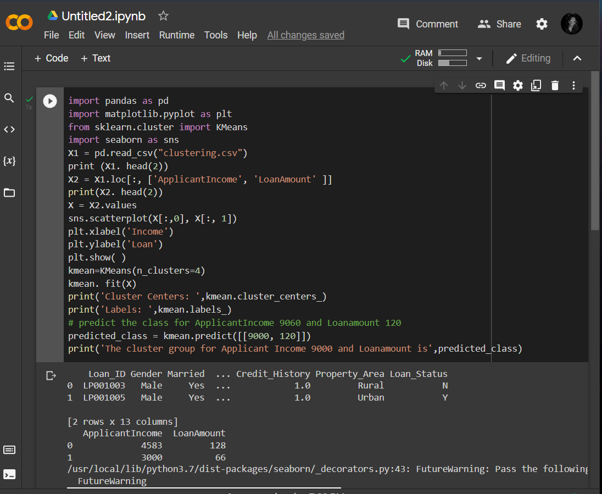

# Implementation of K-Means Clustering Algorithm
## Aim
To write a python program to implement K-Means Clustering Algorithm.
## Equipment’s required:
1.	Hardware – PCs
2.	Anaconda – Python 3.7 Installation

## Algorithm:

### Step1
<br>import the necessary packages.

### Step2
<br>Read the csv file.

### Step3
<br>Scatter plot the applicant income and loan amount.

### Step4
<br>Obtain the kmean clustring for 2 classes.

### Step5
<br>
Predict the cluster group of Applicant Income and Loanamount.

## Program:
```
Developed by : Dhanush. S
Ref No : 212221230020

import pandas as pd
import matplotlib.pyplot as plt
from sklearn.cluster import KMeans
import seaborn as sns
X1 = pd.read_csv("clustering.csv")
print (X1. head(2))
X2 = X1.loc[:, ['ApplicantIncome', 'LoanAmount' ]]
print(X2. head(2))
X = X2.values
sns.scatterplot(X[:,0], X[:, 1])
plt.xlabel('Income')
plt.ylabel('Loan')
plt.show( )
kmean=KMeans(n_clusters=4)
kmean. fit(X)
print('Cluster Centers: ',kmean.cluster_centers_)
print('Labels: ',kmean.labels_)
# predict the class for ApplicantIncome 9060 and Loanamount 120
predicted_class = kmean.predict([[9000, 120]])
print('The cluster group for Applicant Income 9000 and Loanamount is',predicted_class)


```
## Output:





<br>

## Result
Thus the K-means clustering algorithm is implemented and predicted the cluster class using python program.